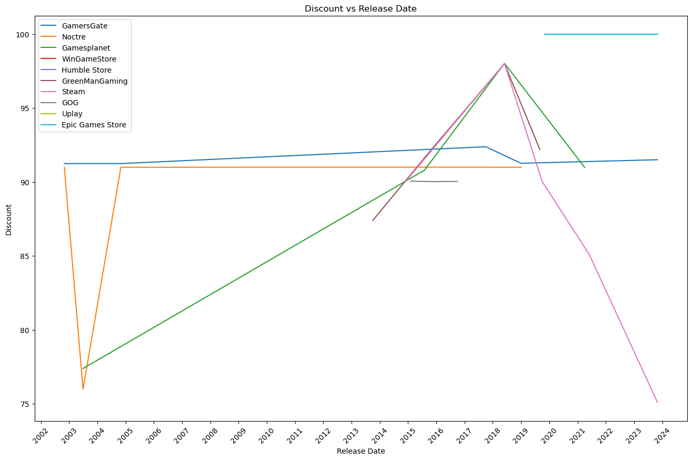
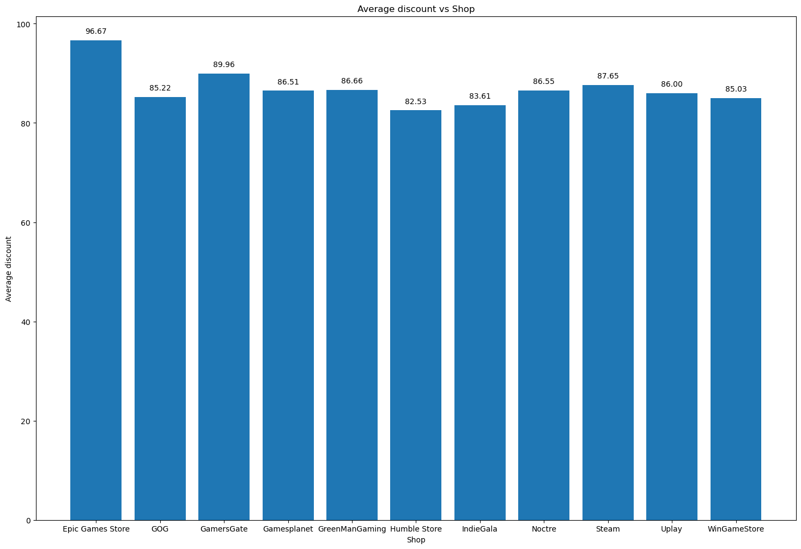

# 📊 Data Analysis of Sales Strategies Oriented to  SQL

## 🎮 Project: Data Analysis of Sales Strategies Oriented to SQL
Welcome to Video Game Deals Analyzer, a project designed to analyze and visualize video game deal data, providing valuable insights into discounts and trends over time.
## 📋 Table of Contents
- Introduction
- Features
- Installation
- Usage
- Project Structure
- Example Graphs
- Contributing
- License
## 📝 Introduction
This project collects data from various video game stores and analyzes the available deals. It uses different data analysis and visualization techniques to identify patterns and trends in video game discounts.

## ✨ Features
Data Collection: Fetch up-to-date deal data from various video game stores.
Discount Analysis: Analyze the discounts applied to video games over time.
Data Visualization: Generate intuitive and attractive graphs to visualize discount trends.
## 🛠️ Installation
Clone this repository:
`git clone https://github.com/ivanalonsom/Project3_VideoGames_Sales.git`
Navigate to the project directory:
`cd video-game-deals-analyzer`
Create and activate a virtual environment (optional but recommended):
`python -m venv venv
source venv/bin/activate  # On Windows, use venv\Scripts\activate `
Install the required dependencies:
`pip install -r requirements.txt`
## 🚀 Usage
Run the main script to execute the functions from the functions module and generate the graphs using the graphs module:
`python main.py`

## 📁 Project Structure

Project3_VideoGames_Sales/  
│  
├── data/                 # Directory to store collected data  
├── graphs/               # Directory to store generated graphs  
├── main.py               # Main script to run the project  
├── functions.py          # Functions for data collection and analysis  
├── graphs.py             # Functions for data visualization  
├── README.md             # Project README  
└── requirements.txt      # Python dependencies

## 📊 Example Graphs
Here are some example graphs generated by this project:

## 🤝 Contributing
Contributions are welcome! Please follow these steps to contribute:
1. Fork the repository.
2. Create a new branch:
`git checkout -b feature-branch`
3. Make your changes and commit them:
`git commit -m 'Add new feature'`
4. Push to the branch:
`git push origin feature-branch`
5. Open a pull request.

## 🛠️ CREATORS
- https://github.com/ivanalonsom  
- https://github.com/mjimcode

## 📝 Link to the slide presentation (spanish)
  https://docs.google.com/presentation/d/1MOzTYnfQh2p2-W3pegoZOy8caBoqv0sD/edit?usp=drive_link&ouid=112738522280937522947&rtpof=true&sd=true
